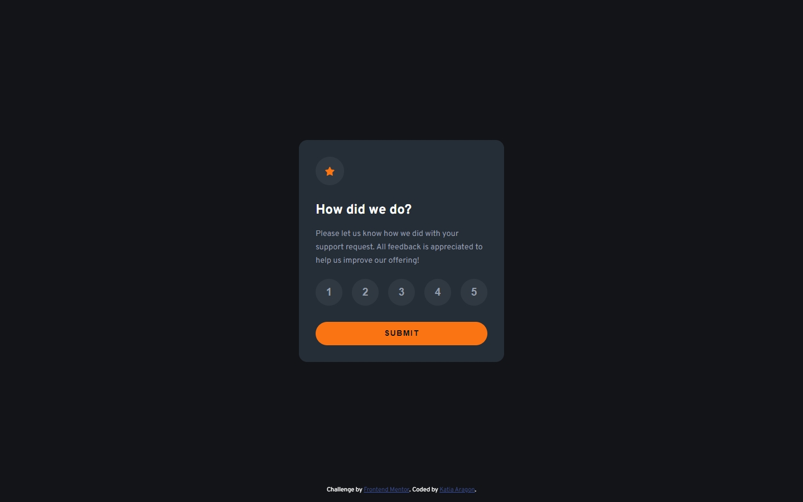
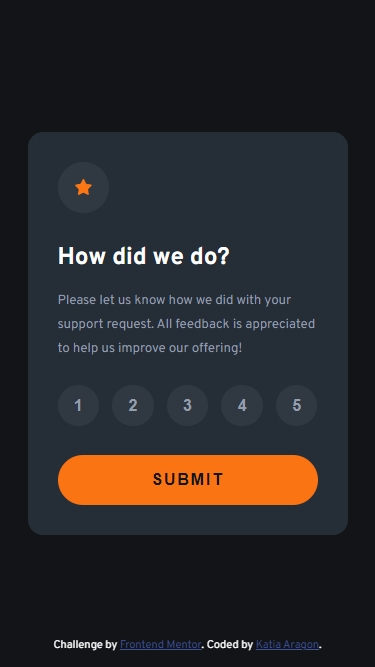
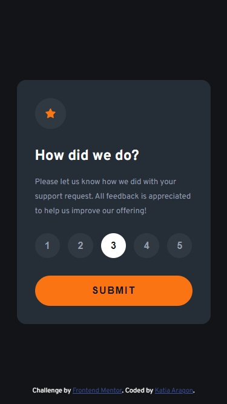
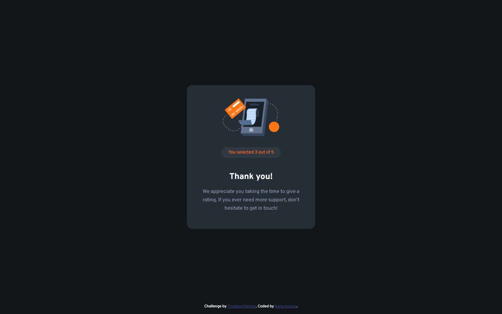

# Frontend Mentor - Interactive rating component solution

This is a solution to the [Interactive rating component challenge on Frontend Mentor](https://www.frontendmentor.io/challenges/interactive-rating-component-koxpeBUmI). Frontend Mentor challenges help you improve your coding skills by building realistic projects. 

## Table of contents

- [Overview](#overview)
  - [Screenshot](#screenshot)
- [My process](#my-process)
  - [Built with](#built-with)
 
## Overview

Users should be able to:

- View the optimal layout for the app depending on their device's screen size
- See hover states for all interactive elements on the page
- Select and submit a number rating
- See the "Thank you" card state after submitting a rating

### Screenshot

## My process

This time I was able to work way more fast on the html and css, but for the script I got kind of stucked, even though I already had in mind what I wanted and needed to do. 
The fact that I still keep on forgetting the methods make me to really slow down, but i'm pretty sure that all can come together with lots of practice. I'm happy with today's results :D

### Built with

- HTML5
- CSS 
- JavaScript

